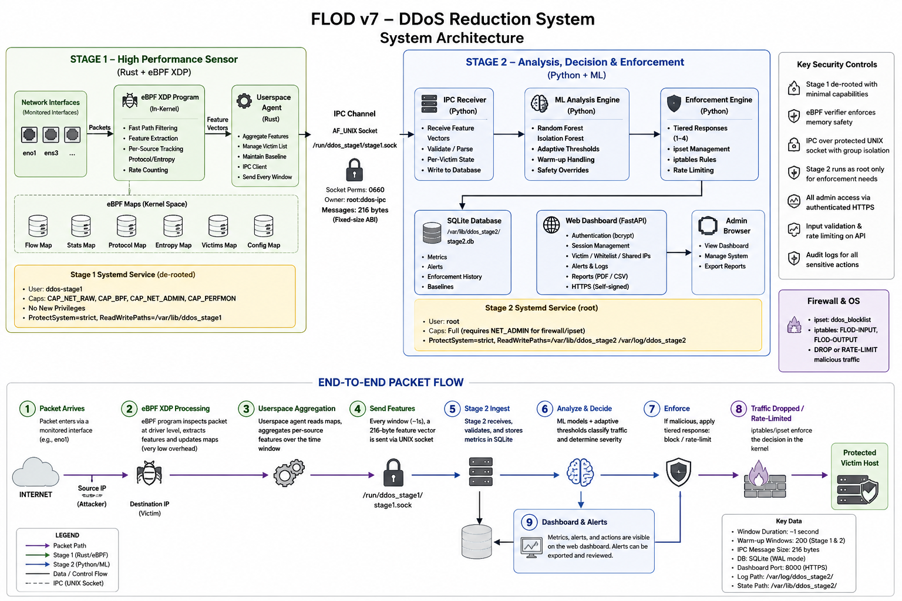
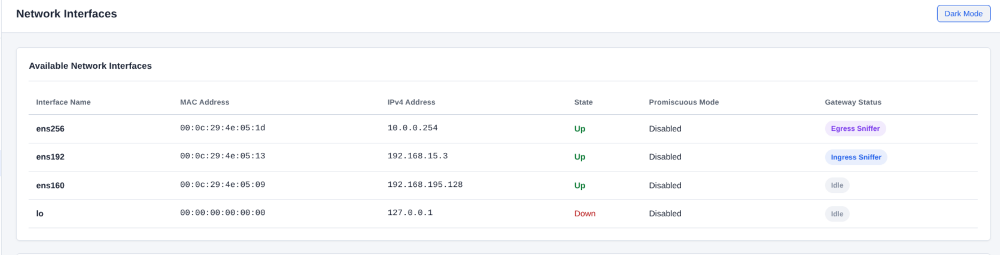
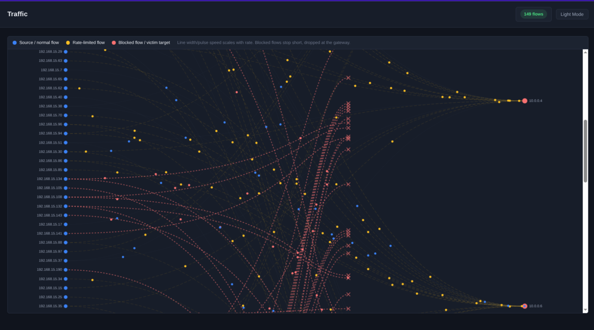
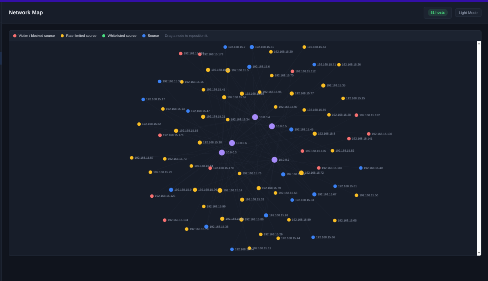

# Architecture



A big picture view of the pipeline described in this document. Illustrative
rather than authoritative on specifics: it predates the V7 map set (drawn
as generic "Flow/Stats/Protocol/Entropy/Victims/Config" maps rather than
the eight actual maps in [Map Sizing](#map-sizing)) and the state
directory move to `/var/lib/flod` (drawn as `/var/lib/ddos_stage2`, see
[Security](security.md)). Where this diagram and the text disagree, the
text is current.

## Why Two Stages

Stage 1 sees every packet. Stage 2 sees one summary per window, roughly one or
two per second per protected host.

That split exists because Python cannot be on the packet path. It is
interpreted, garbage collected, and bound by the interpreter lock, so
allocating an object and parsing a header per packet puts a hard ceiling on
throughput well below what a flood produces. Rust compiles to native code, has
no garbage collector, and parses headers without copying them.

Once traffic is condensed into one feature vector per window, per object
overhead stops mattering, which is what makes scikit learn and pandas safe to
use in Stage 2.

No throughput figures are quoted because none have been measured. The argument
is structural: the per packet path contains no interpreter and no allocator.

## Network Placement

FLOD only sees traffic routed through it. If the source and the protected host
share a bridge and a subnet, they talk directly at Layer 2 and the gateway
never sees a packet, even when configured as their default gateway.

The working layout separates them into two subnets with the gateway routing
between:

```
[ Source ]────► <INGRESS> ──► netfilter (FORWARD) ──► <EGRESS> ────► [ Protected host ]
                    │                  │                  │
              ingress sensor    block or throttle    egress sensor
              (what arrived)      happens here      (what got through)
```

The dashboard's own interfaces page reports which interfaces are up and
which role, ingress or egress sniffer, each one is currently playing:



## The Pipeline

```
[ Packet arrives on ingress interface ]
         │
         │  BPF filter: dst host <protected_ip>  (kernel drops everything else)
         ▼
[ Stage 0: capture thread ]
   pcap reads the frame, etherparse extracts addresses and protocol
   PacketMeta goes into a crossbeam channel
         │
         ▼
[ Layer 1: per packet, analysis thread ]
   entropy accumulator increments the source address counter
         │
         │  window closes on packet count, elapsed time, or a timer tick
         ▼
[ Layer 2: per window ]
   h = normalized source entropy      [0.0 to 1.0]
   r = smoothed packet rate           [0.0 to infinity, pps]
         │
         ▼
[ Layer 3: per window ]
   feed both into their Welford accumulators
   flag if r > mean_r + k * sigma_r        (flood)
   flag if h < mean_h - k * sigma_h        (concentrated source)
         │
         │  reports on a flag, or on the heartbeat
         ▼
[ IPC: feature vector over a Unix domain socket to Stage 2 ]
```

The detection maths behind Layers 2 and 3 is in [detection.md](detection.md).

## Threading

Capture and analysis run in separate threads joined by a bounded crossbeam
channel.

If they shared a thread, every window close would stall capture while it
computed entropy and wrote to a socket. Under a heavy flood even microseconds
of stall overflow the kernel ring buffer and packets are lost silently, which
defeats the measurement.

The channel is bounded on purpose. If analysis falls badly behind, capture
blocks rather than allocating without limit. A stalled capture is visible and
safe; unbounded memory growth is neither.

## Capture Backends

Two, selectable at launch.

**libpcap**, the default. Described in the rest of this section. Works
anywhere, and remains the fallback for interfaces where XDP cannot attach and
for machines without the eBPF build toolchain.

**XDP and TC**, selected with `--capture-mode kernel`. Packet counting moves
into the kernel, so it happens in the driver path rather than after a copy to
user space. User space wakes once per window to drain the maps.

The two differ only in how per window accumulators are filled. Everything from
the window close onward is the same code, so detection cannot tell them apart.

Both have been exercised on the same scenarios: ordinary traffic, a flash
crowd, a flood, and the mixed cases. Measured on 2026-08-22 with independently
learned baselines, their entropy figures agree to within about 1% and their
ingress packet counts to within 6% over the comparable steady phase. One rate
figure, on the busiest and most variable host, differs by more than that, which
is tracked in [roadmap.md](roadmap.md#known-gaps).

### Map Sizing

The kernel side holds eight maps: protected hosts as a prefix trie, a second
trie of addresses excluded from it, per host counters, a per host per source
histogram, a flow table, and, since V7, a per host per source port histogram,
a per host per TTL histogram, and a per host per TCP fingerprint bucket
histogram. Their capacities are compiled into the object as defaults, but a
BPF map's size is fixed when the kernel creates it rather than when the
object is built, so user space overrides the first five before loading.
`--max-sources`, `--max-flows`, and `--max-protected-hosts` therefore change
them without a rebuild, which matters because an object without the eBPF
toolchain cannot be rebuilt at all.

The three V7 maps take no such flag. Port space is 16 bit and TTL space is 8
bit regardless of how many addresses or packets a flood uses, so unlike the
source histogram, neither can be filled by an attacker spreading across more
addresses; 65,536 and 256 are the whole space, not a budget. The fingerprint
histogram is smaller still, a small fixed table of option orderings and
window size ranges rather than a hash of arbitrary bytes.

`--max-protected-hosts` sizes the counter map and the trie together. The
counter map binds first, since the trie stores a whole subnet as a single
entry.

`--max-flows` sizes the flow table on **both** backends. The two are only
comparable if they bound it the same way, and their agreement is a measured
claim rather than a design intention.

The flow table fills before the source histogram does, because a source
reaching several destination ports occupies one entry per port there and one
entry in total in the histogram. The kernel status line reports the occupancy
of both while running.

Per CPU maps hold one value per possible CPU, so the value side of the memory
cost scales with core count and the key side does not. The load line reports an
approximation, and the unit already grants `LimitMEMLOCK=infinity`.

The kernel backend needs a compiled object and the capabilities to load it, so
it is opt in. Without it the sensor behaves exactly as it always has.

### How the eBPF Half Is Arranged

```
stage1-common/    types crossing the kernel boundary, no_std, repr(C)
stage1-ebpf/      the programs, built for bpfel-unknown-none on nightly
stage1/           the sensor, built for the host on stable
```

The eBPF crate is deliberately outside the sensor's workspace. The two halves
target different architectures and different toolchains, and a shared workspace
cannot express that.

`ingress` runs on XDP, before the kernel builds an skb. `egress` runs on TC,
because XDP hooks the driver receive path and cannot observe egress at all.

Nothing is decided in the kernel. There is no floating point and no `log2` in
BPF, so entropy, the rate, and every boundary stay in user space exactly as
described in [detection.md](detection.md). The programs only accumulate:

| Map | Holds | Default | Sized by |
|-|-|-|-|
| `PROTECTED` | Protected hosts, as a prefix trie | 1024 | `--max-protected-hosts` |
| `EXCLUDED` | Addresses carved out of `PROTECTED`, e.g. the gateway itself | 1024 | `--max-protected-hosts` |
| `COUNTERS` | Per host packet and protocol counts | 256 | `--max-protected-hosts` |
| `SOURCES` | Per host, per source counts, which entropy is computed from | 65536 | `--max-sources` |
| `FLOWS` | The flow table behind the network map | 8192 | `--max-flows` |
| `PORT_HIST` | V7: per host, per source port counts, source port entropy | 65536 | fixed, whole port space |
| `TTL_HIST` | V7: per host, per TTL / hop limit counts, TTL variance | 256 | fixed, whole TTL space |
| `FINGERPRINT_HIST` | V7: per host, per TCP SYN fingerprint bucket counts | 64 | fixed, small bucket table |

`PROTECTED` is a prefix trie so one lookup serves both an address list and a
subnet, with a list stored as full length prefixes. Addresses are 16 bytes
throughout, IPv4 stored mapped, matching what the feature vector already puts
on the wire.

`SOURCES` and `FLOWS` are bounded for the same reason the user space flow map
is: their keys come from packet headers, so a randomized source flood would
otherwise try to allocate an entry per packet. The bound is a defence against
unbounded allocation, not a claim about how much traffic is normal, which is
why raising it is a flag rather than a rebuild. Raising it buys accuracy under
a wider flood; it does not remove the exposure.

Build it with `scripts/build-ebpf.sh`. It needs a nightly toolchain and
bpf-linker, both of which `scripts/install.sh` sets up by detecting the LLVM
already on the machine rather than requiring a particular version. Details are
in [testing.md](testing.md).

The backend is optional. Without the toolchain, Stage 1 still builds and runs
on libpcap.

### Running It

```bash
ddos_stage1 --interface <IFACE> --egress-interface <IFACE> \
            --victim-subnet <CIDR> --capture-mode kernel
```

The kernel backend requires `--victim-ips` or `--victim-subnet`. Matching
happens in the kernel against the trie, so there is no equivalent of running
without a filter.

Attachment prefers driver mode and falls back to generic, logging which one it
got. Generic mode is correct but costs more per packet, so a measurement taken
in it is not a measurement of the driver path.

Loading and attaching need `CAP_BPF` and `CAP_NET_ADMIN`, which the service
unit grants. Running the binary by hand needs root or the same capabilities via
`setcap`.

Neither the programs nor the qdisc go away when the process exits.
`scripts/uninstall.sh` detaches both.

### BPF Filtering

The filter is applied by the kernel's BPF engine before any of this code runs.
Packets not addressed to a protected host are discarded in the network driver,
so they never cross into user space at all.

The filter compiles to BPF bytecode, which the kernel verifies and then JIT
compiles to native instructions.

### Tuning

Three settings keep capture ahead of the traffic:

**Snapshot length, 256 bytes.** Only the first 256 bytes of each frame are
copied to user space. That covers Ethernet, VLAN tags, IPv4 or IPv6 with
extension headers, and the TCP or UDP header, which is everything the analysis
layer reads.

Because the payload is cut off, the IP header declares more bytes than are
present. Parsing is therefore lax: it keeps the headers and reports the
shortfall separately, rather than rejecting the frame. Strict parsing here
discarded a significant fraction of traffic before it ever reached detection.

**Immediate mode.** Packets are flushed to the socket buffer as they arrive
instead of waiting for the kernel's buffering window to retire.

**Ring buffer, 128 MB.** At a 256 byte snapshot length that holds roughly
500,000 headers, so a scheduling stall in the sensor does not cost packets.

### Discard Accounting

Capture reports counters every few seconds so a gap between what was captured
and what was analysed points at a cause:

| Counter | Meaning |
|-|-|
| `raw_captured` | Frames handed up by the kernel |
| `parse_failed` | Too short to hold an Ethernet header |
| `non_ip` | Not an IP frame, which the filter should already exclude |
| `truncated` | Payload cut by the snapshot length, still fully analysed |
| `forwarded` | Reached the analysis thread |

A large `truncated` count alongside `parse_failed` at zero is the healthy
state.

The kernel backend logs its own line on the same cadence, since the counters
above come from code that only the pcap backend runs:

| Counter | Meaning |
|-|-|
| `ingress` | Packets counted toward protected hosts |
| `egress` | Packets counted on the egress hook |
| `sources` | Distinct source addresses drained, and how full the map is |
| `flows` | Flow table entries drained |
| `drains` | Map reads in the interval |
| `errors` | Map reads that failed |

`sources` is the one to watch. Its key is attacker controlled, so a randomized
source flood fills the map, after which entropy is computed from a partial view
of the sources and reads higher than it should. Memory stays bounded, which is
the important part, but the measurement degrades quietly. A separate warning
fires when the map is full rather than leaving that to be inferred from the
percentage.

## Egress Measurement

Before this existed, "did mitigation work?" could only be inferred. The gateway
logged that it called for a block and everything downstream assumed traffic
stopped.

Because the sensor routes between two subnets, both halves are observable. The
ingress interface carries what arrived, the egress interface carries what was
forwarded after filtering, and the difference is the drop rate.

**One process, two capture threads.** Both feed the same analysis loop through
a cloned channel sender, so they share one window boundary and one clock. Two
separate processes would each keep their own window on their own timer, and
subtracting mismatched slices of time is noisiest exactly when traffic is
changing fastest.

**Egress never feeds detection.** Egress packets increment a counter and
nothing else. They are excluded from entropy, the source histogram, the
baselines, the window close decision, and the active flows telemetry.

This is deliberate. Egress traffic is downstream of the gateway's own
enforcement, so letting it into the statistics would let past decisions shape
future ones. Detection stays driven purely by what arrives.

For the same reason the drop ratio is not a classifier feature. It is high
precisely because something was already blocked, so training on it would teach
the model to predict its own past behaviour.

Egress capture is optional. Without it the egress fields report as unavailable
rather than as a zero drop rate, since a genuine zero is a meaningful reading.

The dashboard's traffic flow view draws directly on this: blocked flows are
rendered stopping short of the protected host, dropped at the gateway,
rather than fading out or continuing on as if nothing happened.



## Dashboard Rendering

The flow and network views draw from the same active flow list the sensor
writes, and the sensor tracks up to 8192 flows. A flood fills that, and every
entry costs a stroke, a label and a row on each animation frame, with the
network view additionally simulating repulsion across every pair of nodes. The
views were unbounded and a large enough flood froze the browser tab.

What gets drawn is now bounded, and the bound is derived from the panel's own
measured size rather than fixed, so a wall display shows proportionally more
than a laptop does. The network view carries an absolute node ceiling as well,
because its simulation is quadratic in node count and is limited by processor
rather than by screen. Flows are aggregated per source and destination pair
before being ranked, so a source spread across many ports is judged on its
combined rate. Whenever anything is left out the count says so rather than
silently truncating.

The same bound applies to the attack source table, which is rebuilt on every
poll and whose length an attacker controls.



## File Layout

```
stage1-common/     types shared with the eBPF programs
stage1-ebpf/src/   the XDP and TC programs

stage1/src/
  main.rs          CLI, privilege check, thread startup
  capture.rs       pcap capture and header parsing
  analysis.rs      the three layer pipeline
  state.rs         configuration and per target state
  welford.rs       online mean and variance
  ewma.rs          smoothed rate
  entropy.rs       Shannon source entropy
  ipc.rs           feature vector wire format
  persistence.rs   baseline save and restore

stage2/
  stage2.py        entrypoint and app assembly
  ipc_receiver.py  socket listener, classification, tier dispatch
  enforcement.py   ipset and iptables control
  api.py           dashboard state and history routes
  auth.py          login, sessions, request gating
  users.py         account management
  db.py            SQLite audit writers
  schema.py        database layout and migrations
  config.py        paths and enforcement configuration
  models.py        request validation
  storage.py       JSON file helpers
  state.py         shared in memory state
  reports.py       PDF and CSV export
  alerts.py        Discord and SMTP dispatch
  train.py         RandomForest training
  train_isolation_forest.py  Isolation Forest training
  setup_admin.py   first account provisioning
  static/          dashboard pages
  tests/           test suite

scripts/
  install.sh       installer
  update.sh        rebuild and restart
  uninstall.sh     teardown
  run.sh           run both stages from a working copy, prompting for values
  train.sh         select a training CSV and train the RandomForest, the
                    Isolation Forest, or both
  calibrate.py     derive the sigma floors from observed traffic
  build-ebpf.sh    compile the eBPF programs
  test.sh          run every suite
  lib-toolchain.sh LLVM and bpf-linker detection, sourced by the others
```

`scripts/run.sh` is for development and demonstrations, not deployment. It
starts Stage 1 out of the build directory, optionally alongside Stage 2, and
asks for every value it needs rather than requiring a command line. Stage 2 is
optional because Stage 1 retries the IPC socket and keeps analysing without it,
which is what a run for calibration or a backend comparison wants. Deployment
is `install.sh` and systemd.

This layout is the source tree, not where a deployed Stage 2 actually runs
from. `install.sh` copies its code and virtual environment into
`/opt/flod/stage2`, root owned, and points mutable state, the database,
JSON config, trained models, at `/var/lib/flod`, since Stage 2 runs as
root and must not execute anything from a directory the checkout's owner
can still write to. See [Security](security.md) for why. `scripts/run.sh`
above and a developer's own virtual environment (`CONTRIBUTING.md`) are
the exception, running straight from this tree deliberately, since
neither crosses a privilege boundary.

## Dependencies

Stage 1:

| Crate | Purpose |
|-|-|
| `pcap` | Frame ingestion from the kernel ring buffer |
| `etherparse` | Header parsing without copying |
| `crossbeam-channel` | Bounded channel between capture and analysis |
| `byteorder` | Explicit little endian IPC serialisation |
| `log`, `env_logger` | Levelled logging |

Every statistical algorithm uses only the standard library.

Stage 2 dependencies are pinned in `stage2/requirements.txt`.
