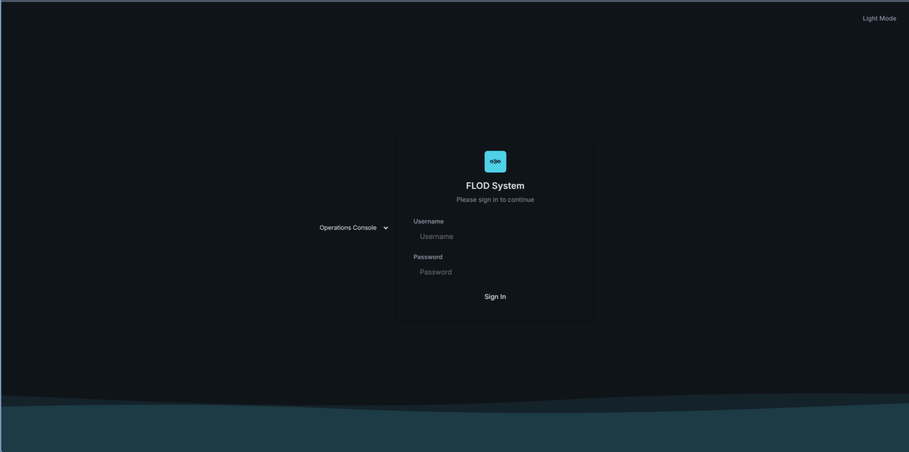

# Security

Beyond the statistical poisoning defences in [detection.md](detection.md), this
covers what an attacker or a misconfigured deployment could target directly.

To report a vulnerability, see [SECURITY.md](../SECURITY.md). Not the issue
tracker.

## Threat Model

Stage 1 runs as a dedicated unprivileged account with only the capability
needed for raw capture. Stage 2 runs as root because it drives ipset and
iptables.

Files holding credentials or secrets are owner only. That protects against
other local accounts, not against root. Since Stage 2 already runs as root,
pre existing root on the sensor host is outside the model; unprivileged local
access is inside it.

**Root never executes code from the working copy.** `install.sh` and
`update.sh` copy Stage 2's source and build its virtual environment into
`/opt/flod/stage2`, root owned, not writable by whichever account ran `git
clone`. Every model file, database, and JSON config a root process reads
lives in `/var/lib/flod`, also root owned, never beside the source. Without
this, an unprivileged account able to write to the checkout, its own
account, or anything with access to it, could plant code or a model that
root would load on the next restart, update, or training run. The
working copy is a source, copied from, from install time onward; only
`scripts/run.sh`, development and demonstrations, and a developer's own
virtual environment (see `CONTRIBUTING.md`) still run directly from it,
deliberately: neither crosses a privilege boundary, since the operator
only ever runs them as themselves.

The code-copy loop in `install.sh` and `update.sh` refuses a symlink at
any of the paths it copies from, rather than only checking that the path
resolves to a regular file. `-f` alone follows a symlink, so a checkout a
non-root account can write to could point a filename `install.sh` expects
at an arbitrary root-readable file elsewhere on disk, and root's own copy
step would read through it and place the contents in the world-readable
runtime directory.

Model files are the one exception to the state migration folding an
existing checkout-rooted install's data into `/var/lib/flod`
automatically. `joblib.load()` deserialises with `pickle`, which can
execute arbitrary code as the loading process, root here, so a
`.joblib` sitting in a location the checkout account can write to is not
promoted automatically the way the database and JSON config are.
Upgrading a pre-existing install with real models on disk needs `sudo
scripts/train.sh` to retrain them directly into `/var/lib/flod`, or a
manual, verified copy as root.

## Transport and Authentication

The console serves over HTTPS when a certificate is present, and the installer
generates a self signed one. Without a certificate, Stage 2 refuses to start
rather than silently serving the login form, the session cookie, and every
block or unblock call in cleartext on `0.0.0.0`: an administrative control
plane defaulting to unencrypted is a real exposure, not a convenience worth
defaulting to. Setting `FLOD_ALLOW_INSECURE_HTTP=1` opts back into the plain
HTTP fallback explicitly, for a trusted lab network or local testing.

The session cookie is marked secure only when TLS is actually configured. A
secure cookie is never sent over plain HTTP, so setting it unconditionally
would lock out every deployment without a certificate.

Passwords are hashed with bcrypt, replacing a single unsalted round of SHA-256.
There is no default credential anywhere in the code. If the setup script was
never run, startup logs a warning and no login is possible. The same minimum
password strength enforced on every other account applies to the first
administrator account, not only ones created afterward.

Login attempts are throttled per client address, five failures in five minutes
followed by a lockout, to slow online brute forcing. The current password
re-entry that account management requires is throttled the same way, keyed by
the caller's own username: an authenticated session must not be able to guess
its own account's password without bound.

Sessions expire after ten minutes of inactivity. The cookie's own expiry
slides with that activity too, refreshed on every authenticated request, so an
actively used session is not logged out by a fixed client side timer while the
server side session is still current.

## Input Validation and Output Encoding

Every address shaped field accepted from the dashboard is validated with
Python's `ipaddress` module before it can reach ipset or be stored. Without
this a CIDR string would be silently expanded by ipset into every host in the
range rather than the single address intended.

Dashboard pages that render server supplied strings escape them through shared
helpers. These were previously interpolated raw, a stored scripting path that
could run arbitrary code in an authenticated session. Since the session cookie
is HTTP only, script injection was the more dangerous path in, not the less:
injected code can call any endpoint same origin regardless of whether it can
read the cookie.

CSV export neutralises spreadsheet formula injection and uses proper quoting
rather than manual string formatting.

## Process and Filesystem Isolation

The IPC socket, the active flows telemetry, and the training label switch all
live in a root owned directory shared through a dedicated group, rather than a
world writable temporary directory.

Previously any local account could race to bind the socket path ahead of Stage
2, for instance during a restart, and either receive live telemetry or inject
fabricated windows straight into the enforcement pipeline.

**The socket's permission bits are the primary control, and every accepted
connection's UID is checked against who is expected to be on the other
end besides.** `SO_PEERCRED` reports the kernel verified real UID of the
connecting process, root, or the de-rooted Stage 1 service account, not
something a connecting process can claim to be. This is defence in depth
on top of an already sound control: the socket's mode and group already
determine who can connect at all, `SO_PEERCRED` catches the case where
that boundary is somehow broader than intended, group membership drifting,
a permission bug, rather than being the only thing standing between an
unexpected local account and the enforcement pipeline.

The database, the whitelist, the target list, and the saved configuration are
all owner only, in `/var/lib/flod`, not beside the source. They were
previously world readable, letting any local account read credentials or
enforcement thresholds off disk.

Every JSON config write goes through a temp file in the same directory
followed by an atomic rename, so a reader never observes a half written
file and a crash mid write leaves the previous complete file in place
rather than a truncated one. Reads refuse to follow a symlink planted at
the path (`O_NOFOLLOW`), and creating a missing file for the first time
uses `O_CREAT|O_EXCL` rather than a separate existence check, closing the
race between the two.

The database permission is set before write ahead logging is enabled. SQLite
gives the sidecar files the mode the database has when it creates them, and
those files hold recently written pages including user rows.

## Request Handling

A request body cap is checked from the declared length before the body is read,
and applies to every endpoint rather than only the export that motivated it.

PDF export is built entirely from server side state: the logs table, the
metrics history, and the live enforcement lists. It takes no request body and
accepts no client supplied image or chart data, so there is nothing to size
cap or clean up on the way in.

## Account Management

Creating an account, deleting one, or changing a password all require the
caller to re enter their own current password, verified against the caller's
stored hash rather than the target account's.

A session cookie alone, one that leaked through a brief scripting window or was
left signed in on a shared machine, used to be enough to durably take over
every admin account.

Sessions record their username, so a password change or account deletion
immediately invalidates every other live session for that user rather than
leaving a hijacked session usable until its own timeout.

The "cannot delete the last account" guard and the duplicate username check are
each enforced as a single atomic statement rather than a check followed by an
act. The separate pair left a race where two concurrent deletes could both pass
the check before either committed, leaving zero accounts.

Account deletion takes its parameters as a request body rather than query
parameters. A query string can land in access logs and browser history, which
is the wrong place for a password.

The alerts endpoint does not echo the configured webhook URL back in the clear.
It is a bearer credential: anyone holding it can post to that channel. It is
reduced to a boolean, matching how the stored mail password is handled, and the
dashboard only sends a new value when the operator types one.

A failed delivery is redacted the same way before it reaches a log line or the
test-alert response. A network exception does not necessarily contain the
webhook URL as one contiguous string, so the token is stripped by matching the
path pattern itself rather than the full URL; the SMTP username and password
are stripped as literal substrings.

## Dependency Pinning

`stage2/requirements.txt` pins every dependency to an exact version rather
than a lower bound. `install.sh` and `update.sh` both run `pip install -r
requirements.txt` as root; an unbounded minimum lets a routine update
silently pull in whatever a compromised or malicious release on PyPI
happens to publish next. Bumping a version is a deliberate edit to this
file, tested first, not something that happens automatically underneath
an update.

## Resource Bounds

Anything keyed by attacker controlled data needs an explicit bound.

The flow map is capped, since its key comes from packet headers and a
randomized source flood would otherwise allocate an entry per packet.

The channel between capture and analysis is bounded, so a slow consumer blocks
the producer rather than growing memory without limit.
