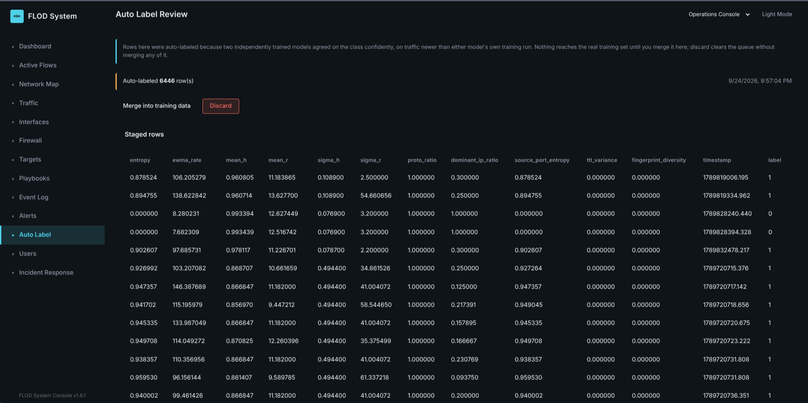
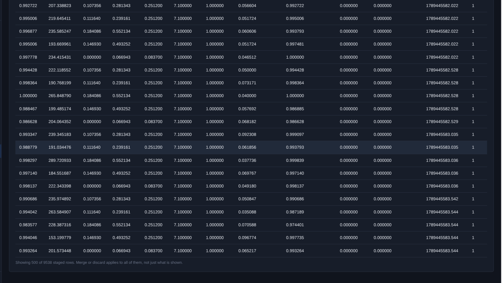
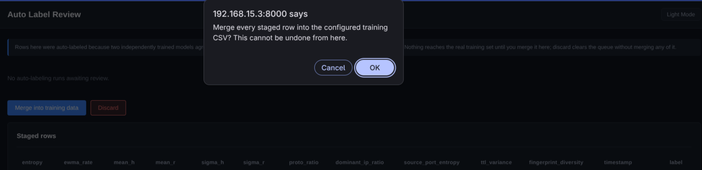
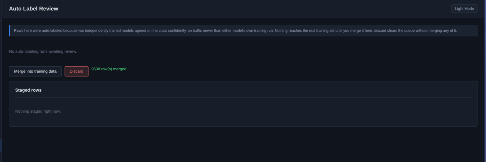

# Training the Classifier

## Capturing Data

Start the sensor writing every post warm up window to a CSV:

```bash
sudo ddos_stage1 --interface <IFACE> --victim-ips <IP> --label 0 --train-csv <PATH>
```

In this mode every window is written, not only the flagged ones.

Traffic generation is deliberately not prescribed. Use whatever load testing
tools, scripted clients, or packet crafting tools you have. What matters is the
labelling procedure, not the tool.

### The Clean Rule

Never let transitioning traffic carry a label. Wait for traffic to reach its
target rate before applying the label, and set the label back to 0 before
stopping the traffic.

The label is switched at runtime by writing to the label file:

```bash
echo 1 | sudo tee /run/ddos_stage1/train_label
```

That directory is root owned rather than world writable, which is why the
switch needs `tee` instead of a plain shell redirect.

This rule is easy to violate in an automated capture script without
noticing, not just a manual one. A script that starts an attack
generator, sleeps through a ramp period, and only then sets the label
has already-flowing traffic landing in the CSV for that whole
sleep, still stamped with the previous phase's label. Six sessions in
one V7 capture were caught this way: short (a few hundred rows against
a real session's thousands), an elevated rate that did not match their
label, sitting exactly at a phase boundary. Confirmed by comparing each
one against the correctly-labelled session immediately next to it
in the same capture, not from rate or entropy thresholds alone, since a
distributed flood's entropy can look as high as a legitimate crowd's.
Relabelled to match what the traffic actually was rather than discarded.

### Capture Sequence

**Phase 0, peacetime.** Run normal traffic for about four minutes so warm up
completes, then capture about five minutes of steady normal traffic.

**Phase 1, flash crowd.** Start a legitimate surge from many distinct sources.
Wait for full rate, set the label to 1, capture for a few minutes, set it back
to 0, then stop the traffic and wait for the baseline to settle.

**Phase 2a, single source attack.** Start a single source flood at a rate
representative of what you want to defend against. Wait for it to stabilise,
set the label to 2, capture, set it back to 0, stop, wait.

**Phase 2b, distributed attack.** The same as 2a but from many concurrent
sources.

### More Than One Session Per Label

This part is easy to get wrong and it invalidates the evaluation.

A single process run, even one cycling through all four phases, produces only
**one** baseline draw per label, because the baseline lives in memory for the
life of the process rather than the life of the label.

Evaluating generalisation needs at least two independent sessions per label.
Kill and restart the sensor, so it warms up fresh, before capturing a second
normal or flash crowd session. Flipping the label on an already running process
is not a second session.

The CSV is opened in append mode, so every new session lands in the same file
and is picked up automatically. The training script detects session boundaries
from the data itself, using a timestamp gap or a label change, not from how the
file was written.

### An Archetype Worth Capturing

The four phases above do not produce a **hot source flash crowd**: a legitimate
surge where one participant, a monitoring bot or a NAT gateway or a proxy,
contributes a disproportionate share of otherwise normal traffic. That drives
the dominant source ratio up on a benign sample, which is exactly the confusion
the system needs to learn to resolve.

Keep that source's absolute rate modest, tens of packets per second rather than
hundreds, and shrink the overall crowd instead of pushing one source harder.
Pushing it too hard just reproduces a single source attack signature with a
legitimate label on it, which teaches the model the opposite of what you want.

### Generator Timing Regularity

A scripted load or flood tool paces requests far more evenly than real
clients or a real botnet do. `sigma_r`, the rate's standard deviation, is
computed from window to window variation in the smoothed rate; if every
source sends on a fixed schedule, or a flood tool runs unpaced (`hping3
--flood`, which sends as fast as the machine can rather than on any
schedule at all), that variation collapses to almost nothing and `sigma_r`
sits at its configured floor for the entire session no matter how much
traffic is flowing. Every row then carries the same value for a feature the
classifier expects to vary, which teaches "this traffic is mechanically
regular" instead of the class signature you actually want captured.

Before capturing Flash Crowd or DDoS sessions, check that whatever is
generating the traffic:

- Paces requests with a randomised wait time or interval, not a fixed one.
- Varies the active source or user count over the session rather than
  holding it flat for the whole capture.
- Runs a flood tool in short, randomised bursts rather than one continuous
  unpaced flood, so the aggregate rate has real amplitude across windows.

A quick way to check before committing a whole session: after a short test
capture, group the CSV by label and look at `sigma_r`'s spread. If it is a
single repeated value for a label, the generator is too regular and the
session is not worth keeping as is.

Confirmed fixed on a recapture in the simulated lab environment: jittered burst timing (randomised
gaps and packet counts, no unpaced flood mode, no full-silence stretch)
produced real `sigma_r` variation across every label rather than a value
pinned at the configured floor.

## Training

```bash
scripts/train.sh
```

Prompts for the training CSV and which model, or models, to train, then
dispatches to `train.py` for the RandomForest, `train_isolation_forest.py`
for the Isolation Forest, or both. Both models are always trained on the
same cleaned CSV, so they see the same shape of data. Either script can
still be run directly, `cd stage2 && python3 train.py`, when only one model
needs retraining.

**Where the trained model actually lands depends on what it finds.** A
production install (`scripts/install.sh`) runs Stage 2 from a root owned
`/opt/flod/stage2`, loading its models from `/var/lib/flod`, not the
checkout; see [Security](security.md). `scripts/train.sh` detects that
install and writes there instead, which needs `sudo` since that directory
is root only, exactly like updating what a root process will load
should. Run it plainly, without a detected production install, and it
trains into the checkout as before, no `sudo` needed, matching a
development setup. Running `train.py`/`train_isolation_forest.py`
directly follows the same rule: both honour `MODEL_PATH`/`IF_MODEL_PATH`
environment variables, which `scripts/train.sh` sets when it detects a
production install.

The RandomForest script drops rows containing NaN or infinity, computes the
three derived features, and detects capture sessions.

It prints a per class feature range overlap check so you can see whether your
captured classes genuinely overlap in rate, entropy, and concentration space.
Classes that do not overlap are trivially separable, and a model trained on
them will score well while learning nothing useful.

### Two Separate Outputs

**Leave one session out evaluation.** For every session whose label has at
least two sessions, that session is held out entirely, a temporary model is
trained on all the others, and predictions on the held out session are
collected. Results from every fold combine into one report and confusion
matrix.

Sessions whose label has only one session are skipped with a note. Holding out
a class's only session leaves zero training examples of it, which is a coverage
gap rather than a fair test.

This exists because a random or percentage split leaks. Consecutive windows
share baseline state, so a model can memorise a session's fingerprint instead
of generalising, and will report a hollow perfect score.

**The production model.** Trained separately on all available sessions,
balanced by upsampling, and saved as the file Stage 2 loads. The evaluation
above never produces the shipped model.

**Tree depth (and, for the second model below, `max_leaf_nodes`) is swept
across a candidate range and picked from the LOSO results above, not
fixed.** The right value depends on how many independent sessions the
current CSV actually has per class, not a number tuned once on a
different capture set. The winner is the *simplest* candidate within
`ACCURACY_TOLERANCE` (0.005, a starting point not a proven value) of the
best LOSO accuracy seen across the whole sweep, not whichever candidate
scored strictly highest: an unconstrained "pick the max" criterion has no
penalty for complexity, so a fraction of a point of difference, often
noise from a small held-out fold, used to be enough to select a needlessly
deep tree. Both `train.py` and `train_second_model.py` print every
candidate's accuracy and which one was selected and why, each time they
run.

### Reading the Result

Read the confusion matrix, not the headline accuracy. The numbers that matter
for this project's central claim are attack recall and precision, and the cell
counting true flash crowds predicted as attacks. That cell is the one that
represents blocking real users.

## The Isolation Forest

**File:** `stage2/train_isolation_forest.py`

A second, independent model, trained on the same cleaned CSV `train.py`
uses. Unlike the RandomForest, it is unsupervised: it fits on the full
pooled dataset, all three labels together, and never reads the label
column. The question it answers is not what class a window looks like, but
whether it looks like anything in the training set at all, which is what
lets it flag an attack shaped differently from anything captured, one the
RandomForest has no guaranteed reason to recognise regardless of what
features it is given. Trained on the full dataset rather than only the
`Normal` rows, on purpose: a model fit only on normal traffic would answer
"is this normal looking," a narrower question than "is this like anything
either model has learned."

**No manual `contamination` value.** `IsolationForest`'s `contamination`
parameter sets what fraction of the training set it treats as outliers,
and it is swept automatically the same way `train.py` sweeps `max_depth`:
across a fixed candidate list, refitting for each one and keeping whichever
value scores best. It does not have a genuine peak the way `max_depth`'s
LOSO accuracy does, though. The raw score, the DDoS outlier rate minus the
benign outlier rate, climbs the entire way through the candidate range
instead of turning over inside it, because a larger `contamination` simply
flags more of everything and DDoS rows carry a heavier tailed anomaly score
than benign ones. Picking the candidate with the largest raw score would
always land on the edge of whatever range is given, `contamination=0.25` on
a 34,727 row capture, which flags 6.3% of ordinary traffic, roughly one
window in sixteen, as `Anomalous`. That defeats the point of a state meant
to be a rare signal, and it is the same failure shape this project already
fixed once for the entropy floor: a criterion that looks like an optimum
but is really just the boundary of the search range.

The fix caps the benign outlier rate (`BENIGN_OUTLIER_RATE_CAP`, default
0.05, a starting point rather than a proven value, the same convention as
every other tuning default in this project) and selects the
highest-separating candidate that stays under it, falling back to the
least noisy candidate if every one exceeds the cap. On the same 34,727 row
capture this selects `contamination=0.1`: a 28.8% DDoS outlier rate against
a 4.7% benign one.

### Reading the Result

The script prints an outlier rate by label after fitting, explicitly marked
as a sanity check rather than a validation metric: there is no held out
set and no ground truth for "was this an evasive attack," since the label
column was never used for fitting. A DDoS outlier rate meaningfully above
the benign rate is the useful signal; both near zero means `contamination`
is too small to be useful, and both near 100% means it is too large to be
selective. A DDoS outlier rate near 100% on its own is not the goal either:
that would mean the Isolation Forest has re-derived the RandomForest's job
on training data it already saw, not that it will catch an attack shaped
differently from anything in this capture, which is the only case Part B
exists for and the one this in-sample check cannot exercise.

## Both Models at Runtime

Both `.joblib` files load at startup and run every window, independently,
not in sequence or as a fallback chain. See
[enforcement.md](enforcement.md#classification) for how the two verdicts
combine into the `Anomalous` state.

## Reviewing Anomalous Traffic

**File:** `stage2/config.py`, `stage2/ipc_receiver.py`

An `Anomalous` verdict is not itself a label. It means the Isolation Forest
found a window unlike anything in the training set, not what the window
actually is: a new attack shape, a legitimate pattern the Normal or Flash
Crowd sessions never captured, or something else entirely. Deciding which
of those it was needs a person to look at it, the same way any other
labelling decision in this document does. Feeding a flagged window straight
back into `train.py` without that step would train the RandomForest on an
unverified guess, and worse, gives anyone who can shape traffic that gets
flagged a way to influence what the model later learns is acceptable.

Every window the Isolation Forest flags is appended to
`stage2/anomalous_capture.csv`, created on the first flagged window. Its
first thirteen columns are in the exact order `training.csv` uses:

```
entropy,ewma_rate,mean_h,mean_r,sigma_h,sigma_r,proto_ratio,dominant_ip_ratio,
source_port_entropy,ttl_variance,fingerprint_diversity,timestamp,label
```

`label` is always written blank. Nothing fills it in automatically. Three
further columns carry context for the review itself, not for training:
`victim_ip`, the protected host; `if_score`, the Isolation Forest's own
anomaly score for that window, more negative is more unlike training; and
`rf_verdict`, what the RandomForest called it before the Isolation Forest
overrode the display label.

To use it: look at what each flagged window actually was, whatever logs,
traffic captures, or dashboard history are available for that time and
victim. Fill in `0`, `1`, or `2` for any row whose real class you can
determine. Drop `victim_ip`, `if_score`, and `rf_verdict`, and the row is
now a normal training row, appendable to `training.csv` the same way a new
capture session is, following [More Than One Session Per
Label](#more-than-one-session-per-label) above: a handful of individually
reviewed rows is not a session, and does not substitute for one, but it is
real ground truth about a gap the current training data has, which is
exactly what should shape what to capture on purpose next.

## Confidence Gated Automatic Labeling

**File:** `stage2/auto_label.py`

Manual review does not scale with capture volume, and most flagged or
cold-start windows are not actually ambiguous, a second opinion would
call them the same thing a person would. This automates the easy majority
of that review while leaving the same manual path above for whatever it
cannot confidently resolve.

Three capture files feed it. `stage2/pretraining_capture.csv` holds
windows captured before any RandomForest model existed at all, the
cold-start case: no model ran at capture time, so there is no verdict to
reconsider, only the thirteen base feature columns. `stage2/anomalous_capture.csv`
is the same file [Reviewing Anomalous Traffic](#reviewing-anomalous-traffic)
above describes, reused here rather than duplicated, with its three
context columns (`victim_ip`, `if_score`, `rf_verdict`) carried along but
never written into the staged output. `stage2/ddos_capture.csv` holds
windows the RandomForest already confidently calls DDoS, the same
thirteen base columns as `pretraining_capture.csv`, no context columns
since there is no Isolation Forest verdict attached to a DDoS window.

`auto_label.py` runs periodically, via the `ddos-stage2-auto-label.timer`
systemd timer rather than as a thread inside the long running Stage 2
service, so a stuck or slow run cannot affect classification or
enforcement. On each run it re-scores every eligible row in all three
files against the RandomForest and a second, independently trained model
(see [The Second Model](#the-second-model) below), and stages a row into
`stage2/auto_labeled_capture.csv` only when:

- Both models pick the same class.
- Both are confident in it, at or above `AUTO_LABEL_CONFIDENCE_THRESHOLD`.
- Both were trained after the row was captured.

All three capture files are bounded to prevent unbounded growth: by row
count via `AUTO_LABEL_MAX_QUEUE_ROWS` when `auto_label.py` trims them on
each run, and by total file size via `PRETRAINING_MAX_BYTES` at write
time in `ipc_receiver.py`, so the files stay within operator configured
limits.

The freshness check is the core safeguard, not a secondary one. Re-scoring
a row with the same model that already has a blind spot for it, or with a
second model trained before that blind spot existed, just reproduces the
same mistake with new-found confidence. A row only clears this check once
it has genuinely been re-evaluated by models that postdate it. A row that
does not clear all three conditions is left exactly where it is, for the
next run or for a human, the same as an unresolved row already works
today.

Staged rows land in `stage2/auto_labeled_capture.csv`, not directly in
`training.csv`. The columns match `training.csv`'s own order, the same
thirteen columns [Reviewing Anomalous Traffic](#reviewing-anomalous-traffic)
above lists. Merge it in the same way a manually reviewed row is merged
above, appendable to `training.csv` following [More Than One Session Per
Label](#more-than-one-session-per-label): staged rows are not
automatically part of the training set, an operator still decides when to
fold them in.

**A third file, `stage2/ddos_capture.csv`, is how DDoS gets in.**
`anomalous_capture.csv` is only ever written when the Isolation Forest
is consulted, which only happens when the RandomForest already called
the window Normal or Flash Crowd; a window it calls DDoS never reaches
that check, and `pretraining_capture.csv` only fills before any
RandomForest exists on a deployment, closed for good once one has been
trained. Neither ever carried a DDoS row. `ddos_capture.csv` closes
that gap directly: `ipc_receiver.py` writes a window here whenever the
RandomForest confidently calls it DDoS, the same 13 base columns as
the other two files, no Isolation Forest context column since DDoS
never reaches that check. `auto_label.py` processes it exactly like
the other two, same dual-model agreement, same confidence threshold,
same freshness check, before any of it reaches `training.csv`. See
[lessons-learned.md](lessons-learned.md#a-capture-path-that-only-fed-two-of-three-classes)
for the full history of the gap this closed.

### Reviewing From the Dashboard

The Auto Label page does the same review, from a browser instead of the
terminal. A completed run with rows to review shows up as a timestamped
entry there, and on the sidebar as a badge everywhere else in the
console. Merge appends every staged row into `TRAINING_CSV_PATH`
(unset by default, the same environment variable `install.sh`/
`update.sh`'s `--training-csv` flag sets for the retrain timer, so one
choice covers both); Discard clears the staged file without merging
any of it. Both act on the whole staged file at once, not a
row-by-row selection: reviewing one alert and reviewing all of them is
the same action, since every pending run points at the same shared
queue.

The staged rows are shown 500 to a page, with Previous and Next buttons
under the table and a "Rows 1 to 500 of N" line. Paging changes only
what is displayed. Merge and Discard still apply to every staged row.









### Degenerate Windows Are Never Auto-Labeled

A run against the lab gateway's captured data auto-labeled 32,597 rows on
its first unattended pass, agreement and confidence both satisfied. Cross
referencing the labeled rows against `training_data.csv` found that 32,595
of them carried `entropy`, `proto_ratio`, `dominant_ip_ratio`,
`source_port_entropy`, `ttl_variance`, and `fingerprint_diversity` all
exactly `0.0`, a zero-traffic window rather than a genuine observation of
any class. That same all-zero pattern occurs across every label in the
training set, Normal, Flash Crowd, and DDoS alike, so two models
agreeing on it reflects a gap shared by both models' training data, not a
real signal.

`is_row_degenerate()` checks those six fields before either model scores a
row, and a row where all six read `0.0` is left exactly where it is, the
same as an unresolved row, regardless of what confidence or agreement the
models would otherwise report. Rate-based fields (`ewma_rate`, `mean_r`,
`sigma_r`, `mean_h`, `sigma_h`) are deliberately excluded from this check:
an idle window can still carry a real rate reading, and this guard exists
to catch the absence of traffic-shape signal, not a particular rate.

### Periodic Retraining

**Files:** `ddos-stage2-retrain.service`, `ddos-stage2-retrain.timer`

The freshness safeguard above means a model that never changes eventually
blocks auto-labeling permanently: every captured row is older than an
unretrained model, not younger than it. `--training-csv <path>` on
`install.sh` or `update.sh` installs a systemd timer that retrains all
three models, RandomForest, Isolation Forest, and the second model,
together against the same CSV, on a configurable interval
(`--retrain-interval`, default `7d`), so the RF and second model's
mtimes move together and the freshness check has something to clear. No
default path is guessed: there is no CSV every deployment should
retrain against, so the timer is only installed when an operator names
one explicitly. It runs at the same low priority as the labeling timer
(`Nice=10`, `CPUWeight=20`, `IOSchedulingClass=idle`), since a weekly
retrain job takes meaningfully longer under that throttling than an
unthrottled manual run, a deliberate tradeoff so it cannot contend with
live enforcement during a real flood.

The Isolation Forest is included for a different reason than the
freshness safeguard: it does not gate on freshness at all, but a model
whose contamination rate and decision boundary were selected against an
old capture keeps scoring new live traffic against that stale boundary
indefinitely otherwise. A functional test on the lab gateway found
exactly this: benign generated traffic against a months-old Isolation
Forest read as `Anomalous` on effectively every logged window. Retraining
it on the same schedule and the same CSV as the other two models keeps
its boundary current without adding a second operator-facing setting.

### The Second Model

**File:** `stage2/train_second_model.py`

A `HistGradientBoostingClassifier`, fit on the same cleaned feature set
`train.py` uses, all three labels, supervised. Deliberately a different
learning process from the RandomForest, boosting builds its trees
sequentially correcting the previous trees' errors, rather than the
RandomForest's bagged, independently grown trees, so agreement between
the two is a real second opinion rather than the same model asked twice.

Train it with:

```bash
scripts/train.sh -w sm
```

or `-w all` to train the RandomForest, Isolation Forest, and second model
together. Like the other two models, `scripts/train.sh` detects a
production install and writes to `/var/lib/flod` with `sudo` in that
case, the checkout otherwise, per [Training](#training) above.

## Capture Under the Tuning You Deploy

The classifier and the Isolation Forest are trained on feature rows, and two
of those columns, `sigma_h` and `sigma_r`, are not measurements of traffic.
They are the sensor's learned standard deviations, clamped between the
configured sigma floors and ceilings. A training set captured under one set of
floors and a sensor running another hold the same traffic at different
values in those two columns.

The Random Forest and the second model barely use them (importance 0.0015 and
0.0020 for `sigma_h` and `sigma_r` in the Random Forest). The Isolation Forest
fits on every column, so it is affected. Measured on 2026-09-18: the
canonical training set was captured with `sigma_h` near 0.05 to 0.08 and `sigma_r`
pinned at 50.0 in 57% of rows, and rows from a gateway running recalibrated
floors carry `sigma_h` 0.4944. An Isolation Forest trained on the training set
flagged 100% of those gateway rows as outliers. With only those two columns
swapped into the training set's range, it flagged 27.3% of the Normal rows and 0.0%
of the Flash Crowd rows.

Practical rules:

- Run `scripts/calibrate.py` first, apply the floors, and leave them alone
  for the whole capture. Calibrating again mid-session splits the file into
  regimes.
- Rows captured on a deployed gateway (`ddos_capture.csv`,
  `anomalous_capture.csv`, the auto-labeled file) are in the deployed
  regime. Do not pool them with an older training set without checking the two
  columns first: `sigma_h` and `sigma_r` per label, distinct values, and
  the share sitting exactly on a floor.
- A sensor restart re-runs warm-up for every target, and baselines restore
  from disk. Restarting during a capture mixes warm-up rows and restored
  baselines into one session.

## Confidence and Tree Depth

`auto_label.py` accepts a row only when both models pick the same class with
probability at or above `AUTO_LABEL_CONFIDENCE_THRESHOLD` (default 0.90). A
Random Forest's probability is the average of its trees' leaf purities, so
its ceiling depends on tree depth. The depth sweep used to pick the simplest
depth within `ACCURACY_TOLERANCE` of the best accuracy, which on the current
training set is depth 3, tied with depths 4 and 5 at 0.997. It now also measures,
for every depth, the share of held-out rows classified correctly at or above
`AUTO_LABEL_CONFIDENCE_THRESHOLD`. Among the depths within the accuracy
tolerance it keeps those within 2 points of the best share and takes the
simplest, which is depth 6 on the current training set (0.995 accuracy, 88% of
held-out rows correct at 0.90 or above, against 75% at depth 3).

On live DDoS windows from the gateway, the depth 3 forest tops out near 0.86
and calls every one of them DDoS. Refitting on the same data at depth 4 puts
93% of the same rows at or above 0.90, with the same 100% called DDoS and the
same leave one session out accuracy. At depth 3 the 0.90 gate sorts rows by
which coarse leaf they land in. In the 2026-09-18 runs it accepted 445 of
16,585 DDoS rows in one pass and 6,788 of 26,317 in another, and 71% of the
rejected rows sat between 0.85 and 0.90. Lowering the threshold to 0.85
would have accepted 20,642. On the 26,316 DDoS windows the 2026-09-19 benchmark
captured in its attack phases, 64% of those depth 3 calls reach 0.90, against 90%
at depth 5 and 96% at depth 6.

Neither depth turns the confidence gate into a quality filter. The check that
adds independent information is the second model, a different algorithm, and
the freshness rule below.

The freshness rule compares file modification times: a row is eligible only
if both models were saved after it was captured. Retraining on unchanged data
saves new files with functionally identical models, so passing the rule shows
only that the models were re-saved.

## Labeling From a Benchmark

**File:** `scripts/label_from_benchmark.py`

The live benchmark records which traffic classes ran in each phase and when the
phase began, so a captured window inside a phase has a known label without any
model's opinion. The script reads one or more benchmark run directories and the
capture files copied from the gateway, and writes a 13 column CSV in the training
format:

```bash
scripts/label_from_benchmark.py \
    --run benchmark-live-results/session_X/kernel_run1 \
    --run benchmark-live-results/session_X/pcap_run1 \
    --capture ddos_capture.csv --capture anomalous_capture.csv \
    --out benchmark_labeled.csv
```

A phase with attack traffic is DDoS, a phase with Flash Crowd and no attack is
Flash Crowd, and a phase with only Normal traffic is Normal. Rows in the first 15
seconds and last 15 seconds of a phase (`--margin`) and phases with no traffic
are skipped. By default only labels 0 and 1 are written, since the capture files
hold windows the models called DDoS or doubted, so a Normal or Flash Crowd row in
them is one the models got wrong. `--labels 0,1,2` adds the DDoS rows.

This is how a shape the training set lacks gets into it. The benchmark's `hot` Flash
Crowd variant (one source far above the rest) has a dominant source share of 0.2
to 0.3, where the training set's Flash Crowd rows have 0.03 to 0.09, and a depth 3
forest calls it DDoS. Merge the output into the training CSV the way any other
labeled rows are merged, then retrain. `train.py` drops Flash Crowd rows below
100 packets per second, so a hot window below that rate does not reach training.

## Where Merge Writes

The dashboard's Merge appends into `TRAINING_CSV_PATH`, and the periodic
retrain job trains on the same file. `install.sh` and `update.sh` set both
from one `--training-csv` flag, so a merge lands in the data the next retrain
reads. Point the flag at a file you are prepared to grow, and keep any reference
dataset elsewhere.

`update.sh` regenerates the `ddos-stage2` unit on every run and writes
`TRAINING_CSV_PATH` only when the flag is given. Running it without the flag
removes the setting, and the dashboard then reports "No training CSV is
configured" and disables Merge. That is the intended behavior for an
unset path, and it also happens by accident after a plain `update.sh`.

